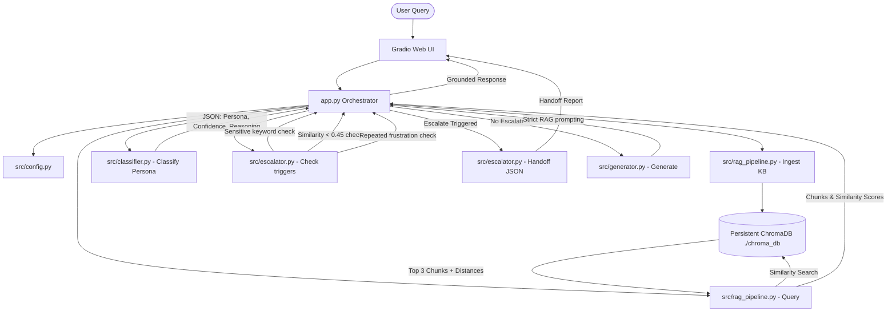

# 🤖 Persona-Adaptive Customer Support Agent

A production-quality customer support system that dynamically classifies user communication personas (Technical Expert, Frustrated User, Business Executive), retrieves grounded contextual documentation from a local persistent vector database via RAG, generates adapted responses tailored to the user's communication style, and escalates sensitive, low-confidence, or persistent frustration cases to human agents with a structured JSON handoff report.

---

## 📐 System Architecture

The following diagram illustrates the lifecycle of a user query, showcasing the RAG ingestion pathway, classification processing, escalation check-points, and generation mapping:



---

## 🛠️ Tech Stack & Key Libraries

- **Language**: Python 3.11+
- **Large Language Model API**: Google Gemini API via the official `google-genai` SDK
  - **Text Generation**: `gemini-2.5-flash`
  - **Text Embeddings**: `text-embedding-004`
- **Vector Database**: `chromadb` (Persistent Local Vector Store)
- **Text Chunking**: LangChain `RecursiveCharacterTextSplitter`
- **PDF Extraction**: `pypdf`
- **User Interface**: `gradio`
- **Dependency Isolation**: `python-dotenv`
- **PDF Construction (Sample Data)**: `reportlab`

---

## 📁 Repository Directory Structure

```
persona-support-agent/
│
├── data/                             <-- 15+ Helpdesk Articles (TXT, MD, PDF)
│   ├── password_reset_guide.pdf      <-- Programmatically compiled PDF
│   ├── billing_policy.txt
│   └── ... (additional files)
│
├── src/                              <-- Core Backend Engine Package
│   ├── __init__.py                   <-- Packages indicator
│   ├── config.py                     <-- Env validations, thresholds, and paths
│   ├── utils.py                      <-- Loggers, PyPDF extractor, retry decorator
│   ├── classifier.py                 <-- Structured output persona classifier
│   ├── rag_pipeline.py               <-- Chroma DB management & text chunking
│   ├── escalator.py                  <-- Keyword match, score checks, handoff generator
│   └── generator.py                  <-- Persona-adapted LLM responder
│
├── app.py                            <-- Main Gradio dashboard launcher
├── generate_kb.py                    <-- Script to generate sample articles
├── test_scenarios.py                 <-- Programmatic test verification suite
├── requirements.txt                  <-- Locked python dependencies
├── .env.example                      <-- Environment configuration keys
└── README.md                         <-- Setup manual & architecture guides
```

---

## ⚙️ Installation & Local Setup

### 1. Clone & Navigate to Workspace
Open your terminal (PowerShell on Windows or Bash on Linux/macOS) and enter:
```bash
git clone <repository-url>
cd persona-support-agent
```

### 2. Configure Virtual Environment
Create a virtual environment to manage dependencies:
```powershell
# Windows
python -m venv venv
.\venv\Scripts\activate

# macOS/Linux
python3 -m venv venv
source venv/bin/activate
```

### 3. Install Dependencies
Install all required modules:
```bash
pip install -r requirements.txt
```

### 4. Setup Environment Variables
Create a `.env` file in the root directory and add your Google Gemini API key:
```bash
cp .env.example .env
```
Open `.env` in a text editor and update:
```env
GEMINI_API_KEY="your_actual_gemini_api_key_here"
```

---

## 🚀 Running the Application

### 1. Ingest Knowledge Base and Launch UI
Run the Gradio web server:
```bash
python app.py
```
Upon launching, the app checks if the `data/` folder is populated with at least 15 help center articles. If not, it executes the generation script automatically to compile all sample documents (including the PDF file `password_reset_guide.pdf`). It will then run the indexer to split text and build vector representations in `./chroma_db` before opening the Gradio dashboard at `http://127.0.0.1:7860`.

### 2. Run Automated Verification Test Suite
Verify that the classifier, retriever, generator, and escalator modules satisfy the 5 target scenarios by executing:
```bash
python test_scenarios.py
```

---

## 🧪 Testing Scenarios Guide

The system includes automated validations for these scenarios:

| Scenario # | Input Query | Expected Persona | Expected Action & Output |
| :--- | :--- | :--- | :--- |
| **1** | *"Where is the guide to clear cookies? It's been an hour and nothing is loading on your interface!"* | **Frustrated User** | Begins with empathetic validation, avoids jargon, and uses simple bullet points. |
| **2** | *"What are the header parameter requirements for your bearer token auth implementation?"* | **Technical Expert** | Detailed response with HTTP header code blocks and API details. |
| **3** | *"Our operational uptime is decreasing. We need a timeline of when billing disputes are resolved."* | **Business Executive** | Brief response focusing on SLA, resolution timeline, and business impacts. |
| **4** | *"I'm experiencing an issue with your database integration that's causing internal errors."* | **Technical Expert** | Returns connection pool settings and configuration details from context. |
| **5** | *"My billing statement has unexpected duplicate charges. I demand an immediate refund!"* | **Frustrated User** | **Trigger Escalation**: Sensitive keyword matched, displays `Handoff Required` and outputs structured handoff JSON. |

---

## ☁️ Hugging Face Spaces Deployment

The repository is pre-configured with the required metadata in the frontmatter of this `README.md`.

To deploy on Hugging Face Spaces:
1. Create a new Space on [huggingface.co/spaces](https://huggingface.co/spaces) and select **Gradio** as the SDK.
2. Link your Git repository or push these files to the Space's repository.
3. In the Space's Settings, add a Repository Secret:
   - **Key**: `GEMINI_API_KEY`
   - **Value**: Your actual Gemini API key.
4. Spaces will automatically detect the frontmatter config, install `requirements.txt`, build the UI, and run `app.py` on launch.
